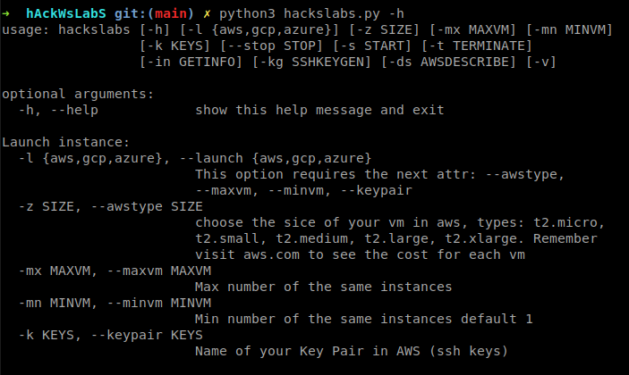
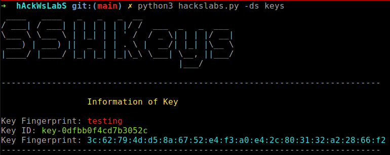

# <p style="text-align: center;"> ıllıllı hAcksWlbaS ıllıllı </p>

   [](https://travis-ci.com/MoisesTapia/hAcksWLabS)

 Deploy your kali linux machine in aws 

## Tools and packages do you need

- [X] [awscli](https://docs.aws.amazon.com/cli/latest/userguide/cli-configure-files.html)
- [X] boto3
- [X] argparse
- [X] art

```bash
python3 pip3 -r install requeriments.txt
```

## Help



## SSH KEYS example


## How to use

After installing boto3

Next, set up credentials (in e.g. ~/.aws/credentials):

```python
[default]
aws_access_key_id = YOUR_KEY
aws_secret_access_key = YOUR_SECRET
```
Then, set up a default region (in e.g. ~/.aws/config):

```python
[default]
region=us-east-1
```


```bash
➜  hAckWsLabS git:(main) ✗ python3 hackslabs.py -h      
usage: hackslabs [-h] [-l {aws,gcp,azure}] [-z SIZE] [-mx MAXVM] [-mn MINVM]
                 [-k KEYS] [--stop STOP] [-s START] [-t TERMINATE]
                 [-in GETINFO] [-kg SSHKEYGEN] [-ds AWSDESCRIBE] [-v]

```
## Example
```bash
python3 hackslabs.py -l aws -z t2.micro -mx 1 -mn 1 -k KaliLinux
```

## Commands to use this script

|  short   |     large     |         help           |
|----------|:-------------:|-----------------------:|
|    -z    |   --awstype   |  type of the instance  |
|   -mx    |   --maxvm     |  Max number of VM      |
|   -mn    |   --minvm     |  Min number            |
|   -k     |   --keypair   |  SSH Keys Pairs in AWS |
|   -l     |   --launch    |  Launch instance       |
|          |   --stop      |  Stop instances        |
|   -s     |   --start     |  Start instances       |
|   -t     |   --terminate |  Terminate instances   |
|   -in    |   --getinfo   |  all information of vm |
|   -v     |   --version   |  get version of script |
|   -ds    |   --describe  |  get info of sshkeys   |
|   -ds    | --intances-types|  get info instances and types |


## [Amazon EC2 Instance Types](https://aws.amazon.com/ec2/instance-types/?nc1=h_ls)

|  Instance   |     vCPU*     |  CPU Credits / hour | Mem GiB|  Storage  | Network Performance |
|-------------|:-------------:|---------------------|:------:|-----------|:-------------------:|
|  t2.nano    |       1       |           3         |   0.5  |  EBS-Only |           Low       |
|  t2.micro   |       1       |           6         |    1   |  EBS-Only |   Low to Moderate   |
|  t2.small   |       1       |           12        |    2   |  EBS-Only |   Low to Moderate   |
|  t2.medium  |       2       |           24        |    4   |  EBS-Only |   Low to Moderate   |
|  t2.large   |       2       |           36        |    8   |  EBS-Only |   Low to Moderate   |
|  t2.xlarge  |       4       |           54        |    16  |  EBS-Only |      Moderate       |
|  t2.2xlarge |       8       |           81        |    32  |  EBS-Only |      Moderate       |


## Use docker to deploy this tool

```bash
docker build -t hackslabs:0.1.0 .
```
## Run the docker container

```bash
docker run -d -ti --name hackslabs <image_id>
```

## verify that container is running

```bash
docker ps
```
## Execute commands inside of container

```bash
docker exec -ti <conatiner_name> /bin/bash
```